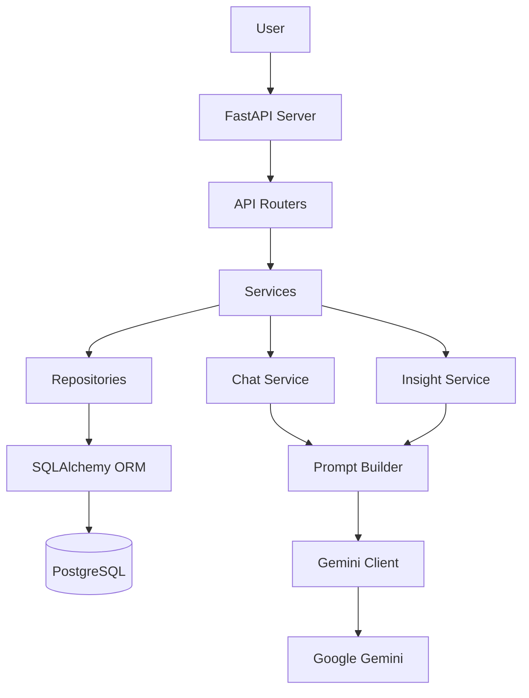
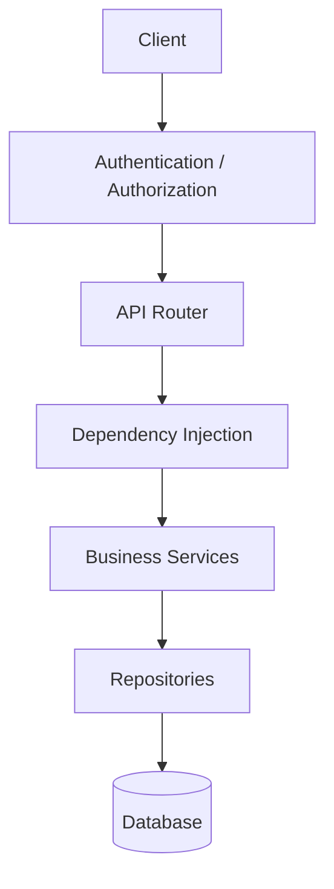
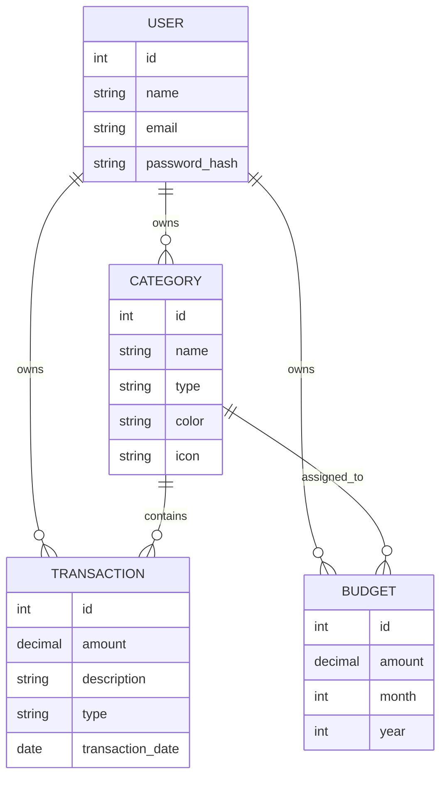
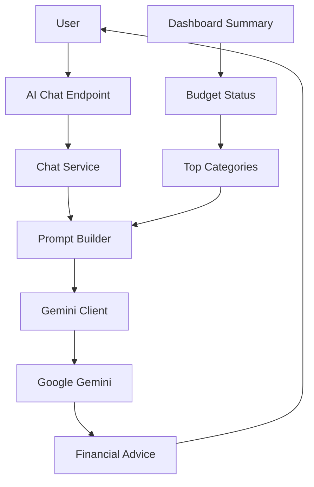
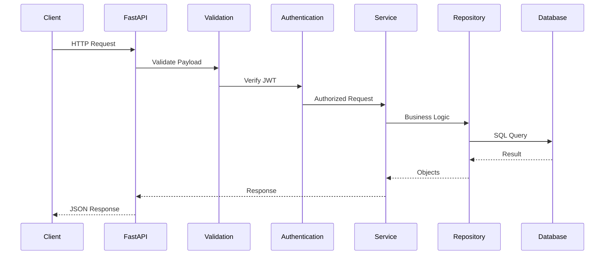
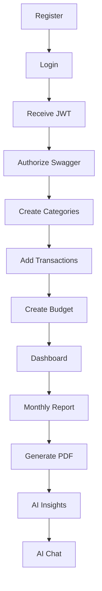
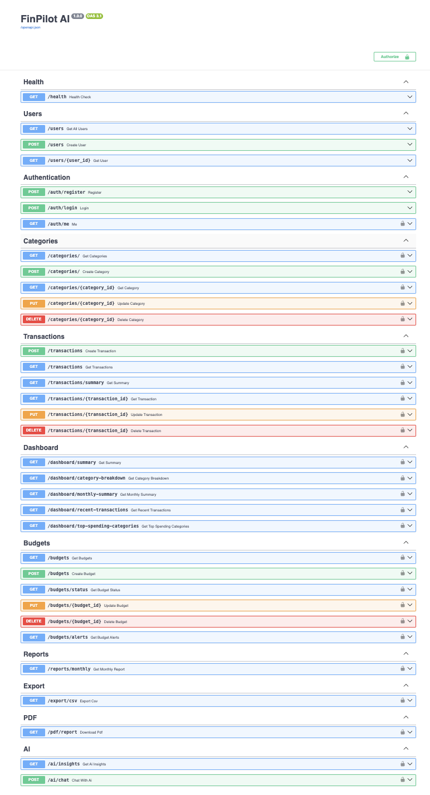

# 💰 FinPilot AI — Intelligent Personal Finance Management Backend

<p align="center">
  
</p>

<p align="center">
  <b>An AI-powered personal finance backend built with FastAPI, PostgreSQL, SQLAlchemy, JWT authentication, and Google Gemini.</b>
  <br>
  Designed as a production-inspired backend system with layered architecture, ownership-aware authorization, automated testing, Docker containerization, database migrations, and live cloud deployment.
</p>

<p align="center">
  <a href="https://finance-assistant-1tks.onrender.com"></a>
  <a href="https://finance-assistant-1tks.onrender.com/docs"></a>
  
  
  
  
  
  
</p>

---

## 📑 Table of Contents

1. [Project at a Glance](#-project-at-a-glance)
2. [Design Principles](#️-design-principles)
3. [Key Features](#-key-features)
4. [System Architecture](#-system-architecture)
   - [High-Level Architecture](#high-level-architecture)
   - [Backend Architecture](#backend-architecture)
   - [Database Schema](#database-schema)
   - [AI Architecture](#ai-architecture)
   - [Request Lifecycle](#request-lifecycle)
5. [User Flow](#-user-flow)
6. [Project Structure](#-project-structure)
7. [Technology Stack](#️-technology-stack)
8. [Getting Started](#-getting-started)
9. [API Documentation](#-api-documentation)
10. [API Reference](#-api-reference)
11. [Business Rules](#-business-rules)
12. [Security](#-security)
13. [Error Handling](#️-error-handling)
14. [Testing](#-testing)
15. [Deployment](#️-deployment)
16. [Roadmap](#-roadmap)
17. [FAQ](#-frequently-asked-questions)
18. [Contributing](#-contributing)
19. [Author](#-author)
20. [License](#-license)

---

## 📌 Project at a Glance

FinPilot AI is a backend-first personal finance platform that lets authenticated users track transactions, manage categories and budgets, generate financial reports, and receive AI-powered financial insights — all through a secured, ownership-aware RESTful API.

| Capability | Status |
|---|---|
| REST API | ✅ Live |
| PostgreSQL | ✅ Connected |
| JWT Authentication | ✅ Implemented |
| Transactions, Categories & Budgets | ✅ Implemented |
| Dashboard Analytics | ✅ Implemented |
| Reports, PDF & CSV Export | ✅ Implemented |
| Gemini AI Insights & Chat | ✅ Implemented |
| Database Migrations (Alembic) | ✅ Implemented |
| Automated Tests | ✅ 72 passing |
| Code Quality (Ruff) | ✅ Configured |
| Docker & Docker Compose | ✅ Implemented |
| Cloud Deployment (Render) | ✅ Live |

### 🌐 Live Demo

| Resource | Link |
|----------|------|
| 🚀 Production API | [finance-assistant-1tks.onrender.com](https://finance-assistant-1tks.onrender.com) |
| 📚 Swagger UI | [finance-assistant-1tks.onrender.com/docs](https://finance-assistant-1tks.onrender.com/docs) |
| ❤️ Health Check | [finance-assistant-1tks.onrender.com/health](https://finance-assistant-1tks.onrender.com/health) |

There's no frontend yet — click **Swagger UI** above to explore and test every endpoint directly.

---

## 🏛️ Design Principles

FinPilot AI follows clean architecture: a repository pattern for database abstraction, a service layer for business logic, dependency injection for loose coupling, Pydantic schemas for request/response validation, SQLAlchemy ORM for persistence, centralized exception handling, JWT-based authorization, modular API routing, and an AI layer fully isolated from business logic. This keeps each component focused on a single responsibility and improves maintainability, scalability, and testability.

---

## 🚀 Key Features

**🔐 Authentication** — JWT-based auth, secure registration & login, password hashing, protected endpoints, ownership validation.

**💰 Finance Management** — Income & expense tracking, custom categories, monthly budgets with alerts, financial reports, monthly summaries.

**🤖 Artificial Intelligence** — AI-generated financial insights, conversational chat assistant, personalized recommendations, and spending analysis powered by Google Gemini.

**📄 Reports & Dashboard** — Monthly reports, downloadable PDF and CSV exports, income vs. expense breakdown, budget utilization, and top spending categories.

---

## 🏗️ System Architecture

FinPilot AI follows a layered architecture that separates responsibilities across independent modules following the Repository-Service Pattern.

| Layer | Responsibility |
|-------|-----------------|
| API Layer | Handles HTTP requests and responses |
| Service Layer | Contains business logic |
| Repository Layer | Interacts with the database |
| Model Layer | Defines database entities |
| Schema Layer | Validates request and response data |
| AI Layer | Integrates with Google Gemini |
| Database Layer | Stores persistent financial data |

### High-Level Architecture



### Backend Architecture



### Database Schema

PostgreSQL with normalized relational tables. Main entities are Users, Categories, Transactions, and Budgets, with relationships enforced via foreign keys.



### AI Architecture

The AI module is fully isolated from the rest of the application — every AI request flows through a dedicated service layer rather than talking to Gemini directly, making it easy to swap LLMs or add RAG later.



> **Illustrative example** (actual wording varies per user and per Gemini response): *"Where am I spending the most?"* → *"Your highest spending category is Shopping, followed by Food and Transportation. Reducing Shopping spend could meaningfully improve your monthly savings."*

### Request Lifecycle



---

## 🧭 User Flow



---

## 📂 Project Structure

```text
finance_assistant
│
├── app
│   ├── ai              # Gemini client & prompt builder
│   ├── api              # Routers (health, root, v1/*)
│   ├── auth              # JWT + password hashing
│   ├── core              # App factory, settings, logging
│   ├── database          # SQLAlchemy session/base
│   ├── dependencies      # DI providers, pagination, sorting
│   ├── enums              # Category/transaction/budget enums
│   ├── exceptions        # Domain exceptions
│   ├── models             # SQLAlchemy models
│   ├── repositories       # Data access layer
│   ├── schemas             # Pydantic request/response models
│   ├── services            # Business logic
│   └── main.py
│
├── alembic                # Database migrations
├── docker                 # docker-compose.yml
├── docs                    # banner.png, swagger.png
├── tests                   # pytest suite (API + service layer)
├── Dockerfile
├── alembic.ini
├── pytest.ini
├── runtime.txt
├── .env.example
├── pyproject.toml
└── README.md
```

---

## ⚙️ Technology Stack

| Component | Technology |
|-----------|------------|
| Language | Python 3.12 |
| Framework | FastAPI |
| ASGI Server | Uvicorn |
| ORM | SQLAlchemy |
| Database | PostgreSQL |
| Migrations | Alembic |
| Validation | Pydantic v2 |
| Authentication | JWT (python-jose) |
| Password Hashing | pwdlib (Argon2) |
| AI | Google Gemini (google-genai SDK) |
| PDF Generation | ReportLab |
| Logging | Loguru |
| API Docs | Swagger UI / ReDoc |
| Package Manager | uv |
| Containerization | Docker & Docker Compose |
| Testing | pytest (72 tests) |
| Linting | Ruff |

---

## 🚀 Getting Started

### Prerequisites

| Software | Notes |
|-----------|---------|
| Python | 3.12+ |
| PostgreSQL | Required (or use Docker Compose below) |
| uv | Package manager |
| Google Gemini API Key | Required |

### Clone & Install

```bash
git clone https://github.com/antrika02/finance_assistant
cd finance_assistant
uv sync
```

### Configure Environment

```bash
cp .env.example .env
```

```env
APP_NAME=FinPilot AI
DEBUG=True
HOST=127.0.0.1
PORT=8000

SECRET_KEY=your_super_secret_key
ALGORITHM=HS256
ACCESS_TOKEN_EXPIRE_MINUTES=30

DATABASE_HOST=localhost
DATABASE_PORT=5432
DATABASE_NAME=personal_finance
DATABASE_USER=postgres
DATABASE_PASSWORD=postgres

GEMINI_API_KEY=your_google_gemini_api_key
GEMINI_MODEL=gemini-2.5-flash
```

### Run Migrations & Start the Server

```bash
alembic upgrade head
uv run uvicorn app.main:app --reload
```

Server runs at `http://127.0.0.1:8000`.

### 🐳 Run with Docker (Alternative)

```bash
docker compose -f docker/docker-compose.yml up --build
docker compose -f docker/docker-compose.yml exec api uv run alembic upgrade head
```

This starts three containers: the FinPilot AI API (`http://localhost:8000`), PostgreSQL 17, and pgAdmin (`http://localhost:5050`) for inspecting the database.

---

## 🌐 API Documentation

| Docs | URL |
|------|-----|
| Live Swagger UI | [finance-assistant-1tks.onrender.com/docs](https://finance-assistant-1tks.onrender.com/docs) |
| Local Swagger UI | `http://127.0.0.1:8000/docs` |
| Local ReDoc | `http://127.0.0.1:8000/redoc` |

From Swagger you can register, login, copy the JWT token, click **Authorize**, and test every endpoint interactively.

<p align="center">
  
</p>

---

## 📚 API Reference

All endpoints are RESTful and return JSON.

### 🔐 Authentication

| Method | Endpoint | Protected |
|---------|----------|-----------|
| POST | `/auth/register` | ❌ |
| POST | `/auth/login` | ❌ |
| GET | `/auth/me` | ✅ |

`/auth/login` uses the OAuth2 password flow (`application/x-www-form-urlencoded` with `username` + `password` fields) — this is what Swagger's **Authorize** button submits automatically.

### 📂 Categories

| Method | Endpoint |
|---------|----------|
| POST / GET | `/categories/` |
| GET / PUT / DELETE | `/categories/{id}` |

### 💳 Transactions

| Method | Endpoint |
|---------|----------|
| POST / GET | `/transactions` |
| GET / PUT / DELETE | `/transactions/{id}` |
| GET | `/transactions/summary` |

Supports filtering by `type`, `category_id`, `start_date`, `end_date`, `search`, and pagination/sorting via `page`, `size`, `sort`.

### 📊 Dashboard

| Method | Endpoint |
|---------|----------|
| GET | `/dashboard/summary` |
| GET | `/dashboard/category-breakdown` |
| GET | `/dashboard/monthly-summary` |
| GET | `/dashboard/recent-transactions` |
| GET | `/dashboard/top-spending-categories` |

### 💰 Budgets

| Method | Endpoint |
|---------|----------|
| POST / GET | `/budgets` |
| PUT / DELETE | `/budgets/{id}` |
| GET | `/budgets/status`, `/budgets/alerts` |

Health thresholds: **Healthy** < 80% · **Warning** 80–99% · **Exceeded** ≥ 100%.

### 📄 Reports, Export & AI

| Method | Endpoint | Description |
|---------|----------|-------------|
| GET | `/reports/monthly` | Monthly financial report |
| GET | `/export/csv` | Downloadable CSV of transactions |
| GET | `/pdf/report` | Downloadable PDF financial report |
| GET | `/ai/insights` | AI-generated financial insights |
| POST | `/ai/chat` | Conversational financial assistant |

### Example

```json
POST /ai/chat
{ "message": "How can I reduce my monthly expenses?" }
```

```json
{
  "response": "Your largest spending category is Shopping. Reducing it by 15% could significantly increase your monthly savings."
}
```

---

## ✅ Business Rules

- Categories, transactions, and budgets are user-owned; cross-user access is blocked at the service layer.
- Only one budget is allowed per category per month.
- Dashboard statistics are computed only from the authenticated user's own data.
- Every protected endpoint requires a valid JWT — unauthorized requests return `401`, cross-user access attempts return `403`.

---

## 🔒 Security

Passwords are hashed with Argon2 (via pwdlib) and never stored in plaintext. Every protected route requires a JWT, and protected resources (transactions, categories, budgets) are ownership-validated in the service layer before any data is returned to the caller. The AI layer never accesses the database directly — the Chat and Insight services assemble a summarized financial context (dashboard summary, budget status, top categories) and pass it to the Prompt Builder before calling Gemini, so the model never sees raw transaction records. Sensitive configuration (database credentials, secret keys, Gemini API key) lives in `.env` and is never committed. All input is validated with Pydantic v2. CORS is currently configured with a permissive origin (`allow_origins=["*"]`) — fine for the current API-only surface, but worth restricting to specific origins once a frontend consumes this API.

---

## ⚠️ Error Handling

| Status | Meaning |
|---------|----------|
| 400 | Invalid Request |
| 401 | Unauthorized |
| 403 | Forbidden |
| 404 | Not Found |
| 409 | Conflict |
| 422 | Validation Error |
| 500 | Internal Server Error |

```json
{ "detail": "Transaction not found." }
```

---

## 🧪 Testing

FinPilot AI includes an automated test suite (pytest) covering API endpoints, authentication, business logic, database interactions, AI services, validation, authorization, and error handling. Code quality is checked with Ruff.

```text
72 passed, 1 warning in 5.08s
```

---

## ☁️ Deployment

FinPilot AI is deployed as a production FastAPI service on Render, with a managed Neon PostgreSQL database (`DATABASE_URL`, distinct from the Dockerized PostgreSQL 17 used for local development). The Python runtime is pinned via `runtime.txt` (3.12.10), and `requirements.txt` is exported from `uv.lock` for Render's build.

**Base URL:** `https://finance-assistant-1tks.onrender.com`

Verified health checks:

```text
GET /       → 200 OK
GET /health → healthy, database: connected
HEAD /docs  → 200 OK
```

The application is also cloud-agnostic and can be deployed to any platform supporting ASGI-based Python applications (Railway, Fly.io, Azure, AWS, Google Cloud Run, DigitalOcean) — see [Run with Docker](#-run-with-docker-alternative) for the containerized setup used in local and production-style testing.

---

## 🗺 Roadmap

**✅ Completed**
User Authentication · Categories, Transactions & Budgets CRUD · Dashboard Analytics · Reports, PDF & CSV Export · AI Insights & AI Chat · Exception Handling · Swagger Documentation · Alembic Database Migrations · Docker & Docker Compose · Automated pytest Suite (72 passing) · Ruff Code Quality Checks · Render Production Deployment (Neon PostgreSQL)

**🚧 Planned**
GitHub Actions CI/CD · Email Reports · Multi-Currency Support · Expense Forecasting · OCR Receipt Scanner · Investment Portfolio Tracking · Savings Goals · Notification System · Banking API Integration

**🌱 Future Scope**
Retrieval-Augmented Generation (RAG), voice-based financial assistant, cash flow forecasting, financial health score, Kubernetes, Redis caching, Celery background tasks, and observability with Prometheus/Grafana.

---

## ❓ Frequently Asked Questions

**Why these choices?** FastAPI for performance and automatic API docs; PostgreSQL for relational integrity in a financial domain; SQLAlchemy with the Repository Pattern for a clean, testable data layer; Google Gemini for fast, high-quality reasoning with a simple SDK that can be swapped for another LLM with minimal changes.

---

## 🤝 Contributing

Contributions are welcome — fork the repo and submit a pull request.

```bash
git clone https://github.com/antrika02/finance_assistant
cd finance_assistant
git checkout -b feature/your-feature-name
# make your changes
git commit -m "feat: add your feature"
git push origin feature/your-feature-name
```

Follow the existing project structure, use type hints, keep services independent, and test before submitting. Commit convention: `feat:`, `fix:`, `refactor:`, `docs:`, `style:`, `test:`, `chore:`.

---

## 👩‍💻 Author

**Antrika Kashyap**
Backend Developer | AI Engineer

| Platform | Link |
|----------|------|
| GitHub | [github.com/antrika02](https://github.com/antrika02) |
| LinkedIn | [linkedin.com/in/antrika-kashyap-070502250](https://www.linkedin.com/in/antrika-kashyap-070502250/) |
| Email | antrikakashyap2@gmail.com |

If you found this project useful, consider giving it a ⭐ on GitHub.

---

## 📄 License

Licensed under the MIT License.

---

<p align="center">
  ⭐ Built with FastAPI, PostgreSQL, SQLAlchemy, and Google Gemini AI.
</p>
