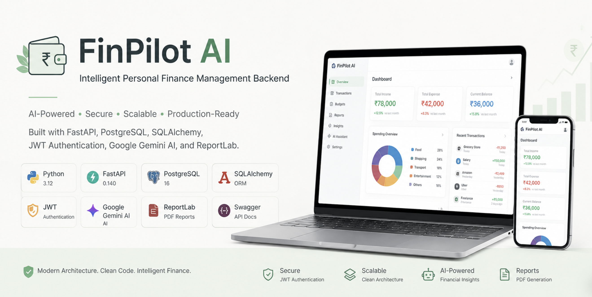
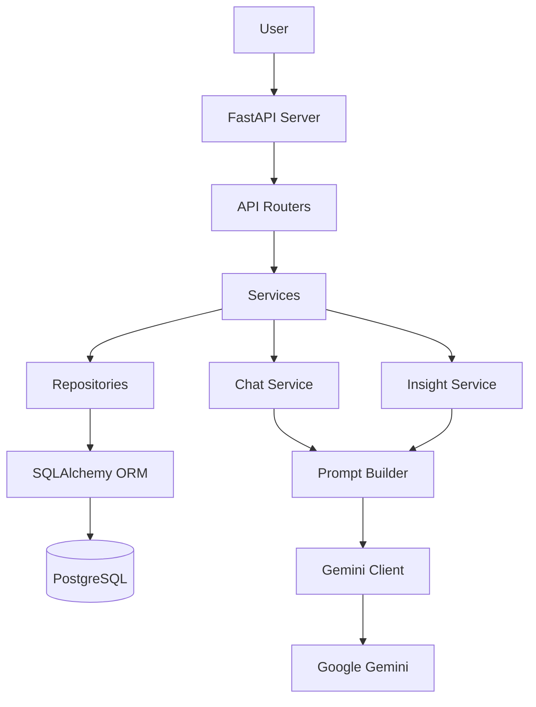
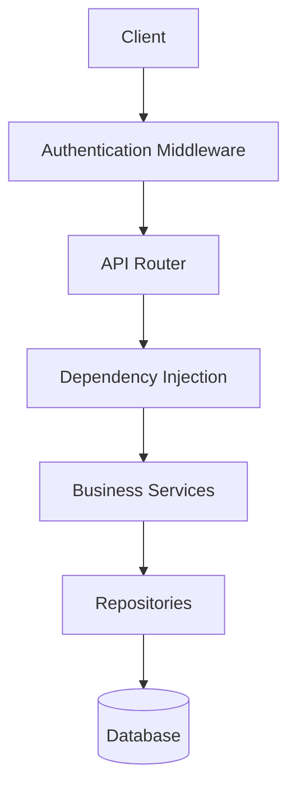
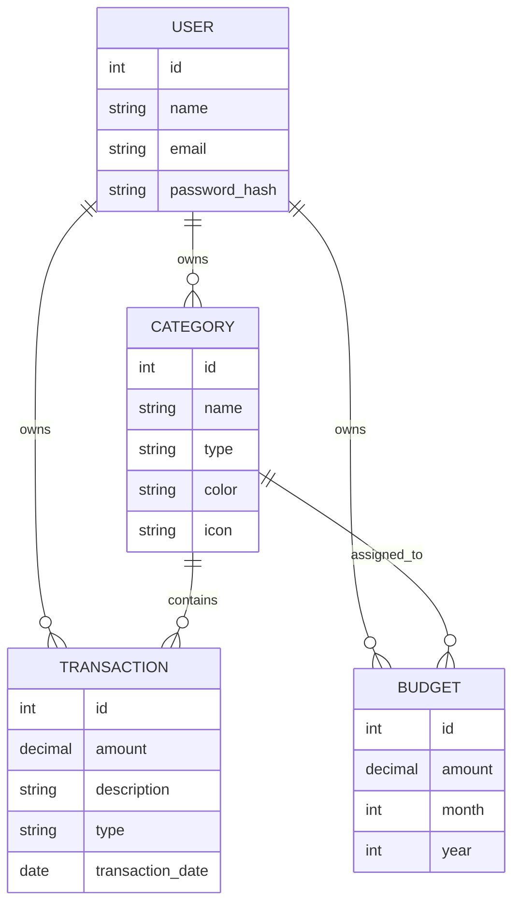
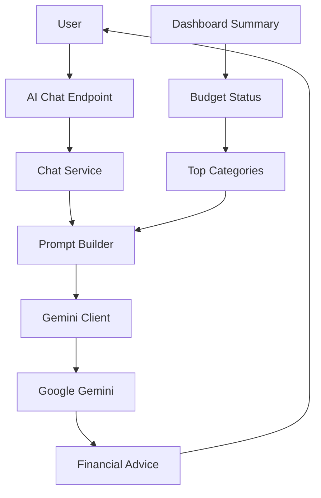
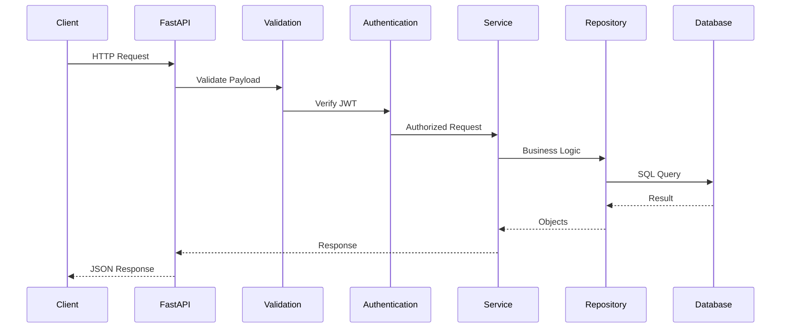
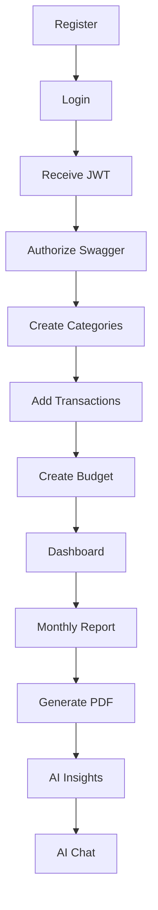

# 💰 FinPilot AI — Intelligent Personal Finance Management Backend

<p align="center">
  
</p>

<p align="center">
  AI-Powered Personal Finance Management Backend built with <b>FastAPI</b>, <b>PostgreSQL</b>, <b>SQLAlchemy</b>, <b>JWT Authentication</b>, <b>Gemini AI</b>, and <b>ReportLab</b>.
  <br>
  Built using production-inspired backend architecture and clean software engineering principles.
</p>

<p align="center">
  
  
  
  
  
  
  
  
</p>

---

## 📑 Table of Contents

1. [Project Statistics](#-project-statistics)
2. [Project Overview](#-project-overview)
3. [Key Features](#-key-features)
4. [Design Principles](#️-design-principles)
5. [System Architecture](#-system-architecture)
   - [High-Level Architecture](#high-level-architecture)
   - [Backend Architecture](#backend-architecture)
   - [Database Schema](#database-schema)
   - [AI Architecture](#ai-architecture)
   - [Request Lifecycle](#request-lifecycle)
6. [User Flow](#-user-flow)
7. [Project Structure](#-project-structure)
8. [Technology Stack](#️-technology-stack)
9. [Getting Started](#-getting-started)
   - [Prerequisites](#-prerequisites)
   - [Installation](#-install-dependencies)
   - [Environment Variables](#-configure-environment-variables)
   - [Database Setup](#️-database-setup)
   - [Running the Server](#️-start-the-development-server)
10. [API Documentation](#-api-documentation)
11. [API Reference](#-api-reference)
    - [Authentication APIs](#-authentication-apis)
    - [Category APIs](#-category-apis)
    - [Transaction APIs](#-transaction-apis)
    - [Dashboard APIs](#-dashboard-apis)
    - [Budget APIs](#-budget-apis)
    - [Report & PDF APIs](#-report-apis)
    - [AI APIs](#-ai-apis)
12. [Business Rules](#-business-rules)
13. [Security](#-security)
14. [Error Handling](#️-error-handling)
15. [Testing](#-testing)
16. [Deployment](#️-deployment)
17. [Roadmap](#-roadmap)
18. [FAQ](#-frequently-asked-questions)
19. [Contributing](#-contributing)
20. [Author](#-author)
21. [License](#-license)

---

## 📊 Project Statistics

| Category | Highlight |
|-----------|-----------|
| 🐍 Language | Python 3.12 |
| ⚡ Framework | FastAPI |
| 🗄️ Database | PostgreSQL 16 |
| 🧩 ORM | SQLAlchemy |
| 🔐 Authentication | JWT (Stateless) |
| 🤖 AI Engine | Google Gemini |
| 📄 Report Engine | ReportLab (PDF) |
| 📚 API Documentation | Swagger UI & ReDoc |
| 🏗️ Architecture | Repository-Service Pattern |
| 📦 Package Manager | uv |
| 🔗 REST Endpoints | 29 |
| 🧱 Architecture Layers | 7 (API, Service, Repository, Model, Schema, AI, Database) |
| 🧭 Feature Modules | 7 (Auth, Categories, Transactions, Budgets, Dashboard, Reports, AI) |

---

## 📖 Project Overview

FinPilot AI is a production-ready AI-powered backend that helps users manage their personal finances through secure authentication, intelligent budgeting, expense tracking, financial reporting, AI-generated insights, and conversational financial assistance.

Unlike a traditional CRUD-based finance application, FinPilot AI combines modern backend engineering practices with Generative AI to provide actionable financial recommendations and natural language financial conversations.

The project follows a scalable layered architecture using the Repository-Service Pattern, dependency injection, modular routing, and clean separation of concerns. It is designed as a portfolio-grade backend project demonstrating modern software engineering principles suitable for production environments.

---

## 🚀 Key Features

### 🔐 Authentication
- JWT Authentication
- Secure Login
- User Registration
- Password Hashing
- Protected Endpoints
- Ownership Validation

### 💰 Finance Management
- Expense Tracking
- Income Tracking
- Categories
- Monthly Budgets
- Budget Alerts
- Financial Reports
- Recent Transactions
- Monthly Summary

### 🤖 Artificial Intelligence
- AI Financial Insights
- AI Financial Chat Assistant
- Personalized Recommendations
- Spending Analysis
- Financial Health Summary
- Gemini AI Integration
- Prompt Engineering

### 📄 Reports
- Monthly Reports
- PDF Export
- Downloadable Financial Summary

### 📊 Dashboard
- Income vs Expense
- Current Balance
- Budget Utilization
- Category Breakdown
- Top Spending Categories
- Recent Transactions

---

## 🏛️ Design Principles

FinPilot AI is designed around clean architecture principles that separate concerns across multiple layers.

- Repository pattern for database abstraction
- Service layer for business logic
- Dependency Injection for loose coupling
- Pydantic schemas for request and response validation
- SQLAlchemy ORM for persistence
- Centralized exception handling
- JWT-based authentication and authorization
- Modular API routing
- AI services isolated from business logic

This architecture improves maintainability, scalability, and testability while keeping each component focused on a single responsibility.

---

## 🏗️ System Architecture

FinPilot AI follows a layered architecture that separates responsibilities into independent modules, making the codebase scalable, maintainable, and easy to test.

| Layer | Responsibility |
|-------|-----------------|
| API Layer | Handles HTTP requests and responses |
| Service Layer | Contains business logic |
| Repository Layer | Interacts with the database |
| Model Layer | Defines database entities |
| Schema Layer | Validates request and response data |
| AI Layer | Integrates with Google Gemini |
| Database Layer | Stores persistent financial data |

This design follows the Repository-Service Pattern, allowing business logic to remain independent from the database implementation.

### High-Level Architecture



### Backend Architecture



### Database Schema

The application uses PostgreSQL with normalized relational tables. Main entities are Users, Categories, Transactions, and Budgets, with relationships enforced using foreign keys.



### AI Architecture

The AI module is completely isolated from the rest of the application. Instead of allowing API routes to communicate directly with Gemini, every AI request flows through a dedicated service layer.



This design makes it easy to replace Gemini with another LLM, modify prompts independently, test AI functionality, and add Retrieval-Augmented Generation (RAG) later.

| Component | Responsibility |
|------------|----------------|
| GeminiClient | Connects to Gemini API |
| PromptBuilder | Builds prompts dynamically |
| InsightService | Generates financial insights |
| ChatService | Handles conversational AI |

**Prompt Engineering** — the application dynamically constructs prompts using real financial data before sending them to Gemini. Each prompt includes the financial summary, budget status, category breakdown, and the user's question, producing personalized and context-aware responses.

#### Example AI Insight

```text
Overall Summary
You spent ₹42,000 this month while earning ₹78,000.
Your savings rate is healthy and you currently have a positive cash flow.

Top Insights
• Food expenses increased significantly.
• Shopping exceeded the allocated budget.
• Transportation spending remained stable.

Recommendations
• Reduce discretionary shopping.
• Increase savings allocation.
• Consider increasing your food budget if spending remains consistent.
```

#### Example AI Chat

```text
User: Where am I spending the most money?

AI: Your highest spending category is Shopping, followed by Food and
Transportation. Reducing Shopping expenses by even 15% would
significantly improve your monthly savings.
```

### Request Lifecycle

Every request follows the same processing pipeline.



---

## 🧭 User Flow

The typical end-to-end journey a user takes through FinPilot AI, from account creation to AI-assisted financial insights.



---

## 📂 Project Structure

```text
FinPilot-AI
│
├── app
│   ├── ai
│   ├── api
│   ├── auth
│   ├── core
│   ├── dependencies
│   ├── exceptions
│   ├── models
│   ├── repositories
│   ├── schemas
│   ├── services
│   └── main.py
│
├── alembic
├── tests
├── images
├── .env.example
├── pyproject.toml
└── README.md
```

---

## ⚙️ Technology Stack

| Layer | Technology |
|--------|------------|
| Language | Python 3.12 |
| Framework | FastAPI |
| ORM | SQLAlchemy |
| Database | PostgreSQL |
| Authentication | JWT |
| Password Hashing | Passlib |
| Validation | Pydantic v2 |
| AI | Google Gemini |
| PDF | ReportLab |
| API Docs | Swagger UI |
| Dependency Manager | uv |
| Server | Uvicorn |

### Core Libraries

| Library | Purpose |
|----------|---------|
| FastAPI | REST API Framework |
| SQLAlchemy | ORM |
| Pydantic | Data Validation |
| Psycopg | PostgreSQL Driver |
| python-jose | JWT Tokens |
| Passlib | Password Hashing |
| ReportLab | PDF Generation |
| Google GenAI SDK | Gemini Integration |
| Uvicorn | ASGI Server |

---

## 🚀 Getting Started

Follow the steps below to set up FinPilot AI on your local machine.

### 📋 Prerequisites

| Software | Version |
|-----------|---------|
| Python | 3.12+ |
| PostgreSQL | 16+ |
| Git | Latest |
| uv | Latest |
| Google Gemini API Key | Required |

### 📥 Clone the Repository

```bash
git clone [https://github.com/antrika02/finance_assistant]
cd FinPilot-AI
```

### 📦 Install Dependencies

This project uses **uv** as the package manager.

```bash
uv sync
```

If you don't have uv installed:

```bash
pip install uv
```

Verify installation:

```bash
uv --version
```

### 🔑 Configure Environment Variables

Create a new `.env` file:

```bash
cp .env.example .env
```

Update the values according to your local environment:

```env
APP_NAME=FinPilot AI
APP_VERSION=1.0.0
APP_ENV=development
DEBUG=True
HOST=127.0.0.1
PORT=8000

SECRET_KEY=your_super_secret_key
ALGORITHM=HS256
ACCESS_TOKEN_EXPIRE_MINUTES=30

DATABASE_HOST=localhost
DATABASE_PORT=5432
DATABASE_NAME=personal_finance
DATABASE_USER=postgres
DATABASE_PASSWORD=postgres

GEMINI_API_KEY=your_google_gemini_api_key
GEMINI_MODEL=gemini-2.5-flash-lite
```

| Variable | Description |
|------------|-------------|
| SECRET_KEY | JWT Secret Key |
| DATABASE_HOST | PostgreSQL Host |
| DATABASE_PORT | PostgreSQL Port |
| DATABASE_NAME | Database Name |
| DATABASE_USER | PostgreSQL Username |
| DATABASE_PASSWORD | PostgreSQL Password |
| GEMINI_API_KEY | Google Gemini API Key |
| GEMINI_MODEL | Gemini Model Name |

### 🛢️ Database Setup

Create a PostgreSQL database:

```sql
CREATE DATABASE personal_finance;
```

Run database migrations:

```bash
alembic upgrade head
```

### ▶️ Start the Development Server

```bash
uv run uvicorn app.main:app --reload
```

or

```bash
python -m uvicorn app.main:app --reload
```

If everything is configured correctly, you should see:

```text
INFO: Uvicorn running on http://127.0.0.1:8000
```

---

## 🌐 API Documentation

Once the server starts, FastAPI automatically generates interactive API documentation.

| Docs | URL |
|------|-----|
| Swagger UI | `http://127.0.0.1:8000/docs` |
| ReDoc | `http://127.0.0.1:8000/redoc` |

From Swagger you can register a new user, login, copy the JWT token, authorize requests, test every endpoint, download responses, and validate schemas.

<p align="center">
  
</p>

### 🔑 Authentication Workflow

1. Register a new user — `POST /auth/register`
2. Login — `POST /auth/login`
3. Copy the generated JWT access token
4. Click the **Authorize** button inside Swagger and enter `Bearer YOUR_ACCESS_TOKEN`

Now every protected endpoint becomes accessible.

---

## 📚 API Reference

All APIs follow RESTful conventions and return JSON responses.

| Base | URL |
|------|-----|
| Local Base URL | `http://127.0.0.1:8000` |
| Swagger | `http://127.0.0.1:8000/docs` |
| ReDoc | `http://127.0.0.1:8000/redoc` |

### 🔐 Authentication APIs

| Method | Endpoint | Description | Protected |
|---------|----------|-------------|-----------|
| POST | `/auth/register` | Register a new user | ❌ |
| POST | `/auth/login` | Login and obtain JWT token | ❌ |
| GET | `/auth/me` | Get authenticated user | ✅ |

### 📂 Category APIs

| Method | Endpoint | Description |
|---------|----------|-------------|
| POST | `/categories/` | Create category |
| GET | `/categories/` | List categories |
| GET | `/categories/{id}` | Get category |
| PUT | `/categories/{id}` | Update category |
| DELETE | `/categories/{id}` | Delete category |

### 💳 Transaction APIs

| Method | Endpoint | Description |
|---------|----------|-------------|
| POST | `/transactions/` | Create transaction |
| GET | `/transactions/` | List transactions |
| GET | `/transactions/{id}` | Get transaction |
| PUT | `/transactions/{id}` | Update transaction |
| DELETE | `/transactions/{id}` | Delete transaction |
| GET | `/transactions/summary` | Financial summary |

Supported filters:

| Parameter | Description |
|------------|-------------|
| type | income / expense |
| category_id | Filter by category |
| start_date | Filter start date |
| end_date | Filter end date |
| search | Search description |
| page | Pagination |
| size | Page size |
| sort | Sort by amount/date |

```
GET /transactions?page=1&size=10&type=expense&sort=-amount
```

### 📊 Dashboard APIs

| Method | Endpoint |
|---------|----------|
| GET | `/dashboard/summary` |
| GET | `/dashboard/categories` |
| GET | `/dashboard/monthly-summary` |
| GET | `/dashboard/recent-transactions` |

Current balance is computed as `Income − Expense`.

### 💰 Budget APIs

| Method | Endpoint |
|---------|----------|
| POST | `/budgets/` |
| GET | `/budgets/` |
| GET | `/budgets/{id}` |
| PUT | `/budgets/{id}` |
| DELETE | `/budgets/{id}` |
| GET | `/budgets/status` |
| GET | `/budgets/alerts` |

Budget health thresholds:

| Status | Percentage Used |
|--------|------------------|
| Healthy | < 80% |
| Warning | 80% – 99% |
| Exceeded | ≥ 100% |

### 📄 Report APIs

| Method | Endpoint |
|---------|----------|
| GET | `/reports/monthly` |
| GET | `/export/pdf` |

### 🤖 AI APIs

| Method | Endpoint | Description |
|---------|----------|-------------|
| GET | `/ai/insights` | Generate AI financial insights |
| POST | `/ai/chat` | Conversational financial assistant |

### 📨 Example Requests

**Register**
```json
POST /auth/register
{
  "name": "John Doe",
  "email": "john@example.com",
  "password": "Password123"
}
```

**Login**
```json
POST /auth/login
{
  "email": "john@example.com",
  "password": "Password123"
}
```

**Create Category**
```json
POST /categories/
{
  "name": "Food",
  "type": "expense",
  "icon": "🍕",
  "color": "#FF5733"
}
```

**Create Transaction**
```json
POST /transactions/
{
  "amount": 1500,
  "type": "expense",
  "description": "Groceries",
  "transaction_date": "2026-08-01",
  "category_id": 1
}
```

**Create Budget**
```json
POST /budgets/
{
  "category_id": 1,
  "amount": 10000,
  "month": 8,
  "year": 2026
}
```

**AI Chat**
```json
POST /ai/chat
{
  "message": "How can I reduce my monthly expenses?"
}
```

**Example Response**
```json
{
  "response": "Your largest spending category is Shopping. Reducing Shopping expenses by 15% could significantly increase your monthly savings."
}
```

---

## ✅ Business Rules

**Transactions**
- Category must exist and belong to the authenticated user.
- Transaction ownership is verified before update/delete.

**Categories**
- Categories are user-specific.
- Users cannot modify another user's categories.

**Budgets**
- Only one budget is allowed per category for a given month.
- Budget category must belong to the authenticated user.
- Budget ownership is validated before modification.

**Dashboard**
- Dashboard statistics are computed only using the authenticated user's data.

**Authentication**
- Every protected endpoint requires a valid JWT token.
- Unauthorized requests receive HTTP `401 Unauthorized`.
- Users attempting to access another user's resources receive HTTP `403 Forbidden`.

---

## 🔒 Security

**Authentication**
- JWT Authentication
- Protected Endpoints
- Secure Password Hashing
- Stateless Sessions

**Authorization**
- Every protected resource is ownership-aware — a user cannot access another user's transactions, budgets, or categories. Ownership validation is performed in the service layer before database operations.

**Password Storage**
- Passwords are never stored in plaintext and are hashed before storage using secure hashing algorithms.

**Environment Variables**
- Sensitive configuration (database credentials, secret keys, Gemini API key) is stored in `.env` and never committed to source control.

**AI Security**
- The AI module never accesses the database directly. All financial information flows through the service layer after ownership validation, which prevents unauthorized data access, keeps prompts user-specific, avoids exposing raw database structures, and centralizes authorization checks.

**Validation**
- The application uses Pydantic v2 for request validation, covering required fields, email validation, date validation, numeric validation, and enum validation.

---

## ⚠️ Error Handling

The application uses centralized exception handling to return consistent error responses.

| Status | Meaning |
|---------|----------|
| 200 | Success |
| 201 | Created |
| 204 | Deleted |
| 400 | Invalid Request |
| 401 | Unauthorized |
| 403 | Forbidden |
| 404 | Resource Not Found |
| 409 | Conflict |
| 422 | Validation Error |
| 500 | Internal Server Error |

```json
{
  "detail": "Transaction not found."
}
```

---

## 🧪 Testing

The application was comprehensively validated through Swagger UI by exercising all CRUD operations, authentication flows, dashboard analytics, report generation, AI endpoints, and error scenarios.

**Modules tested:** Authentication, Categories, Transactions, Dashboard, Budgets, Reports, PDF Export, AI Insights, AI Chat.

**Checklist**
- [x] User Registration
- [x] Login / JWT Authentication
- [x] Category CRUD
- [x] Transaction CRUD
- [x] Dashboard Analytics
- [x] Budget CRUD / Alerts
- [x] Monthly Reports
- [x] PDF Generation
- [x] AI Insights
- [x] AI Chat
- [x] Swagger Documentation

---

## ☁️ Deployment

The application can be deployed on any platform supporting FastAPI, including Render, Railway, Fly.io, Azure App Service, AWS Elastic Beanstalk, Google Cloud Run, and DigitalOcean App Platform.

The application is designed to be cloud-agnostic and can be deployed to any platform supporting ASGI-based Python applications.

**Deployment checklist**
- [ ] Environment variables configured
- [ ] PostgreSQL database available
- [ ] Database migrations executed
- [ ] Gemini API key configured
- [ ] Dependencies installed
- [ ] Swagger loads successfully

---

## 🗺 Roadmap

**✅ Completed**
- User Authentication
- Categories CRUD
- Transactions CRUD
- Dashboard Analytics
- Budget Management & Alerts
- Reports & PDF Export
- AI Insights & AI Chat
- Exception Handling
- Swagger Documentation

**🚧 Planned**
- Docker Support & CI/CD Pipeline
- Unit Testing
- Email Reports
- Multi-Currency Support
- Expense Forecasting
- OCR Receipt Scanner
- Investment Portfolio Tracking
- Savings Goals
- Notification System
- Banking API Integration

**🌱 Future Scope**

| Area | Enhancements |
|------|--------------|
| Finance | Investment tracking, mutual fund analysis, SIP calculator, loan management, credit score monitoring, net worth dashboard |
| AI | RAG, expense forecasting, goal-based planning, budget coaching, voice assistant, receipt OCR, spending predictions |
| Analytics | Interactive charts, yearly reports, cash flow forecasting, savings trends, financial health score |
| Deployment | Docker, Kubernetes, GitHub Actions CI/CD, Redis cache, Celery background tasks, Nginx, Prometheus, Grafana |

---

## ❓ Frequently Asked Questions

**Why FastAPI?**
FastAPI provides excellent performance, automatic API documentation, type safety, and developer productivity.

**Why PostgreSQL?**
PostgreSQL offers strong relational integrity, ACID compliance, and excellent support for financial applications.

**Why SQLAlchemy?**
SQLAlchemy provides a clean abstraction over SQL while maintaining flexibility and performance.

**Why Gemini AI?**
Gemini offers high-quality reasoning, fast responses, and seamless integration for financial analysis.

**Why Repository Pattern?**
Separating database operations from business logic improves maintainability, testability, and scalability.

---

## 🤝 Contributing

Contributions are welcome. If you'd like to improve FinPilot AI, feel free to fork the repository and submit a Pull Request.

1. Fork the repository.
2. Clone your fork:
   ```bash
   git clone [https://github.com/antrika02/finance_assistant]
   ```
3. Create a new feature branch:
   ```bash
   git checkout -b feature/your-feature-name
   ```
4. Make your changes.
5. Commit your changes:
   ```bash
   git commit -m "feat: add your feature"
   ```
6. Push your branch:
   ```bash
   git push origin feature/your-feature-name
   ```
7. Open a Pull Request.

**Development guidelines:** follow the existing project structure, use type hints wherever possible, keep services independent, add meaningful commit messages, test APIs before submitting, and follow PEP-8 conventions.

**Commit convention**
```
feat: add AI financial chat
fix: resolve budget validation issue
refactor: improve dashboard service
docs: update README
style: format code
test: add transaction tests
chore: update dependencies
```

---

## 👩‍💻 Author

**Antrika Kashyap**
Final Year Computer Science Student | Backend Developer | AI Engineer

| Platform | Link |
|----------|------|
| GitHub | `https://github.com/antrika02>` |
| LinkedIn | `https://www.linkedin.com/in/antrika-kashyap-070502250/>` |
| Email | `antrikakashyap2@gmail.com` |

If you found this project useful, consider giving it a ⭐ on GitHub — it helps others discover the project and motivates future improvements.

---

## 📄 License

This project is licensed under the MIT License. Feel free to use it for learning, inspiration, or contribution.

---

## 📌 Project Status

🟢 **Stable** — Version `v1.0.0` — Production Ready

---

<p align="center">
  ⭐ If you enjoyed this project, please consider giving it a Star ⭐
  <br>
  Built with ❤️ using FastAPI, PostgreSQL, SQLAlchemy, and Google Gemini AI.
</p>
